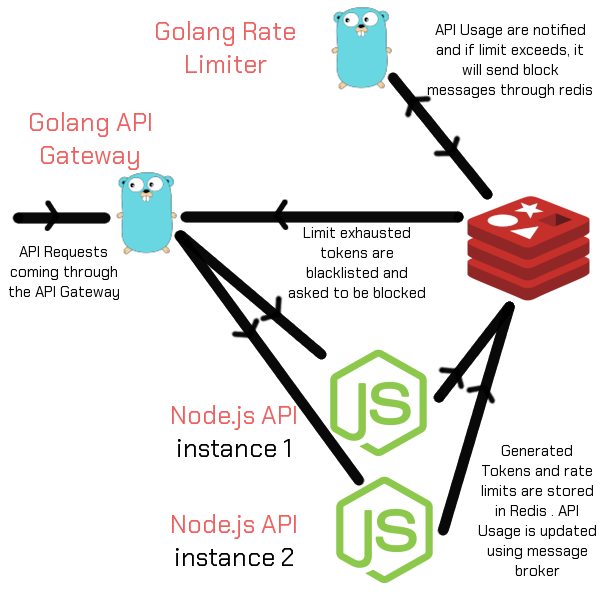

# Golang Redis Rate Limiter [](https://goreportcard.com/report/github.com/shredx/golang-redis-rate-limiter)

It's API limiter built in Go while we were trying out Redis.
It has got dependency on a node app that mock like the API to be limited [node-redis-rate-limiter](https://github.com/shredx/node-redis-rate-limiter)
and [API gateway](https://github.com/shredx/golang-api-gateway).


## Getting Started

### Prerequisite
#### Local Setup
* [Go](https://golang.org/doc/install) -- Development environment
* [dep](https://golang.github.io/dep/docs/installation.html) -- Dependency management
* [Revel](https://revel.github.io/tutorial/index.html) -- Golang web framework
* [Redis](https://redis.io/download) -- Cache storage

#### Docker
* [Docker](https://www.docker.com/products/docker-desktop)
* [Docker Compose](https://docs.docker.com/compose/install/)

### Installation
#### Local Setup
```sh
go get -u github.com/shredx/golang-redis-rate-limiter
cd $GOPATH/github.com/shredx/golang-redis-rate-limiter
dep ensure
```
#### Docker
```sh
git clone https://github.com/shredx/golang-redis-rate-limiter
cd golang-redis-rate-limiter
docker-compose up
```

## Architecture
The architecture might not be perfect as it was just a weekend project to explore Redis.


